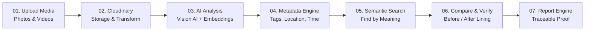

# DivyaDrishti (DDrishti) — Presentation & Product Specification

> **Dynamic Resource for Intelligent Search, Hosting, and Tracking Initiatives**  
> *Product Specification & Architecture Documentation*  
> **Tagline:** Field Media → Evidence | *"The work already happened. We make it visible."*

---

## Executive Summary

**DivyaDrishti** transforms unstructured, scattered field media (photos and videos captured across remote sites) into verifiable, searchable, and audit-ready project evidence. 

Non-profits, government agencies, ESG teams, and donors currently drown in tens of thousands of unorganized field photos across WhatsApp chats, shared drives, and hard drives. DivyaDrishti establishes an **intelligent evidence layer** that automatically indexes visual content using Vision AI and vector embeddings, enabling natural-language search, temporal before/after comparisons, and one-click auditable impact reporting where every statement links back to primary media.

---

## 1. The Problem: Field Evidence Bottleneck

```
[ Field Team Activities ]
       │
       ├── 10,000+ Photos
       ├── 500+ Videos
       └── 40+ Locations across Months of Activity
       │
       ▼
 [ THE BOTTLENECK ]
 ├── Manual Sorting   ──► Hours wasted categorizing folders
 ├── Manual Tagging   ──► Inconsistent tags, lost location context
 └── Manual Reporting ──► Weeks to synthesize impact reports
```

### The Friction Points
* **Find:** *"Where are the Ranchi project photos?"* (Teams struggle to locate specific site imagery across unorganized storage).
* **Verify:** *"Which photos prove the work actually happened?"* (Lack of trusted metadata and temporal lineage makes validation difficult).
* **Report:** *"Turn all of this into a report."* (Field reporting is disconnected from primary assets, leading to unsupported claims).

---

## 2. The Solution: Unified Evidence Layer

DivyaDrishti operates on a simple principle: **"Upload once. Understand everything."**

```
 ┌──────────────────────┐        ┌──────────────────────┐        ┌──────────────────────┐
 │    Raw Field Media   │        │     DivyaDrishti     │        │   Project Evidence   │
 │   (Photos + Videos)  │ ─────► │   Intelligent Core   │ ─────► │  Searchable & Proven │
 └──────────────────────┘        └──────────────────────┘        └──────────────────────┘
```

### Core Capabilities
1. **Understand:** Automatic visual feature detection (objects, infrastructure, human activities, environmental context).
2. **Organize:** Automated structuring by location, timestamp, project category, and milestone.
3. **Search:** Intuitive semantic querying (*"Show me solar pump installations in Bokaro"*).
4. **Compare:** Automated temporal pairing (Before vs. After construction/intervention).
5. **Report:** One-click verifiable impact summaries with source-linked citations.

---

## 3. End-to-End Evidence Journey & Architecture



### Process Breakdown

| Step | Stage | Functionality |
| :--- | :--- | :--- |
| **01** | **Upload** | Ingest raw photos and videos directly from field agents, mobile devices, and project drives. |
| **02** | **Store & Transform** | Cloudinary manages scalable storage, automated media compression, thumbnails, and transformations. |
| **03** | **Analyze** | Computer Vision models identify objects and activities; embedding models project content into vector space. |
| **04** | **Enrich Metadata** | System attaches structured attributes: identified objects, detected activities, geo-coordinates, timestamps, and project associations. |
| **05** | **Semantic Search** | Natural language vector retrieval allows queries based on human conceptual meaning rather than exact file names. |
| **06** | **Compare & Verify** | System correlates historical baseline media with completion media for side-by-side validation. |
| **07** | **Report** | Compiles verifiable reports where summary statistics and claims maintain direct links to original evidence assets. |

---

## 4. Key Platform Features

### Feature A: "Ask Your Evidence" (Natural Language Search)
* Eliminates nested folders and manual keyword guessing.
* Users can query in plain English:  
  > *"Show me water infrastructure projects in Jharkhand before and after construction."*
* Returns clustered, ranked results (e.g., *47 Relevant Assets under Water Access / Jamshedpur*).
* Automatically displays synchronized temporal comparisons:
  * **Baseline:** `BEFORE · MAR 2026` (Foundation excavation & raw materials)
  * **Outcome:** `AFTER · AUG 2026` (Completed water tower and operational tap stand)

### Feature B: Multimodal AI Parsing Under the Hood
Each uploaded file (e.g., `IMG_4821.jpg`) is parsed and indexed with fine-grained multimodal metadata:

```yaml
Asset ID: IMG_4821.jpg
AI Metadata:
  Object: Water tank, Solar panel, Piping
  Activity: Installation, Community commissioning
  Location: Jamshedpur, Jharkhand
  Timestamp: 14 June 2026
  Project: Water Access Initiative
Search Index:
  - Vector embedding generated for visual context
  - Entity tags linked to regional project ledger
```

### Feature C: 100% Traceability & Citation System
No generated figure or narrative claim is left unsubstantiated:
* **Report Claim:** *"14 water systems were installed across 6 locations between Jan–Aug 2026"*
* **Proof Backing:** Direct interactive citation button `[View Evidence →]`.
* **Corroborating Media:** 38 Photos, 7 Videos, tagged across 6 verified GPS clusters.
* Every metric in the dashboard is inspectable down to the exact photo timestamp and original sensor/camera metadata.

### Feature D: One-Click Impact Report Generation
* Transforms thousands of raw assets into donor-ready or audit-ready documents.
* Generates comprehensive summaries:
  * Key KPI Metrics (e.g., *17 Locations, 843 Verified Assets, 14 Completed Installations*).
  * Automated Before & After visual comparison plates.
  * Executive narrative linked directly to primary source media.

---

## 5. Stakeholder & Target Audience Matrix

| User Category | Primary Need | Value Delivered by DivyaDrishti |
| :--- | :--- | :--- |
| **NGOs** | Document ground-level project progress | Eliminates manual sorting; provides instant progress documentation for headquarters. |
| **Government Agencies** | Verify field activities & public expenditures | Transparent, tamper-evident verification of completed public works before fund release. |
| **Sustainability & ESG Teams** | Track environmental & social interventions | Auditable evidence trails for carbon credits, reforestation, and community initiatives. |
| **Donors & Philanthropies** | Inspect funded-project evidence | Real-time visibility into project delivery with zero reliance on subjective reporting. |
| **Campaign & PR Teams** | Convert real field work into authentic stories | Rapid retrieval of high-impact before-and-after visual assets for donor campaigns. |

---

## 6. Technical Stack

```
┌────────────────────────────────────────────────────────┐
│                        FRONTEND                        │
│       React 19 + Vite 8  │  Tailwind CSS v4            │
│       Framer Motion      │  Lucide React               │
└───────────────────────────┬────────────────────────────┘
                            │ REST / Axios
┌───────────────────────────▼────────────────────────────┐
│                        BACKEND                         │
│       FastAPI (Python)   │  SQLite (Relational Core)   │
└───────────────────────────┬────────────────────────────┘
                            │
              ┌─────────────┴─────────────┐
              ▼                           ▼
┌───────────────────────────┐ ┌───────────────────────────┐
│       MEDIA STORAGE       │ │        AI / VECTOR        │
│   Cloudinary Platform     │ │   Vision AI (Objects/Act) │
│ (Upload, Store, Transform)│ │   Embeddings (Semantic)   │
└───────────────────────────┘ └───────────────────────────┘
```

* **Frontend:** React 19, Vite 8, Tailwind CSS v4, Lucide React icons, Framer Motion transitions.
* **Backend:** FastAPI for high-performance async endpoints, SQLite for localized relational data.
* **Media Management:** Cloudinary SDK for direct-to-cloud uploads, secure storage, and optimized image/video delivery.
* **Vision & Vector Engine:** Multimodal AI models for object/activity detection and vector embeddings for semantic similarity search.

---

## 7. Comparative Impact: Before vs. With DivyaDrishti

| Operational Dimension | Before (Traditional Manual Process) | With DivyaDrishti |
| :--- | :--- | :--- |
| **Storage Architecture** | Thousands of scattered files in drives/chats | Centralized, indexed media layer |
| **Tagging & Metadata** | Manual, error-prone, or non-existent | Automated AI understanding (objects, activities, places) |
| **Discovery & Search** | Manual scrolling and folder guessing | Natural-language semantic search ("Ask your evidence") |
| **Progress Validation** | Visual estimation from disconnected albums | Synchronized side-by-side Before/After comparisons |
| **Report Generation** | Days of manual formatting and asset copying | One-click automated impact reports |
| **Verification & Trust** | Unverifiable claims vulnerable to disputes | Traceable evidence: every claim links to original media |

---

## 8. Complete Slide-by-Slide Deck Mapping

For quick reference against the original presentation deck (`DivyaDrishti final.pdf`):

| Slide | Section Header | Title / Content Summary |
| :---: | :--- | :--- |
| **01** | Cover | **DivyaDrishti (DDrishti)** — Dynamic Resource for Intelligent Search, Hosting, and Tracking Initiatives. Field Media Intelligence Platform. |
| **02** | The Field Reality | *"Thousands of field photos. Zero verifiable structure."* Massive phone and WhatsApp media unorganized without EXIF truth. |
| **03** | The Problem | *"The evidence exists. Finding and proving it is broken."* Lost GPS/timestamps, manual tagging fatigue, AI synthetic media risks, disconnected audits. |
| **04** | The Solution | *"Meet DivyaDrishti — Upload once. Understand everything."* Verifiable, geotagged, semantically searchable evidence layer. |
| **05** | Live Ingestion Pipeline | Local project storage buckets ➔ EXIF & GPS parser ➔ Reverse geocoding ➔ C2PA authenticity guard ➔ Drishti Vision AI ➔ 384-dim semantic embeddings. |
| **06** | Explore & Semantic Search | *"Ask your evidence"* — Plain English query calculated via cosine similarity over 384-dim semantic metadata vectors. |
| **07** | Visual Similarity Discovery | Instant semantic clustering across field assets powered by semantic vector distance over AI-derived attributes. |
| **08** | Telemetry & Provenance Audit | Interactive Lightbox inspector: camera settings, exact GPS coordinates with map link, AI scene tags, and authenticity verification badge. |
| **09** | Coming Next: Video Analysis | Up Next: Frame-by-frame video & drone intelligence, keyframe extraction, temporal action detection, and in-video semantic search. |
| **10** | Coming Next: Report Generation | Up Next: One-click verifiable impact reports, automated donor PDF summaries, before/after plates, and clickable evidence citations. |
| **11** | Coming Next: Poster Generation | Up Next: Automated impact posters & campaign creatives, auto-branded visual assets with verified coordinates and badges for social/print. |
| **12** | Future Roadmap & Research | Unconfirmed exploratory capabilities: Drone orthomosaic stitching with NDVI vegetation health, offline-first field PWA, multi-stakeholder cryptographic sign-off, satellite cross-verification. |
| **13** | Live Tech Architecture | Built with modern production tech: React 19, Vite, Tailwind CSS, FastAPI, SQLite, local storage buckets, Drishti Vision AI, 384-dim dense embeddings. |
| **14** | The Mission | *"The work already happened. We make it visible and provable."* DivyaDrishti Field Intelligence. |
