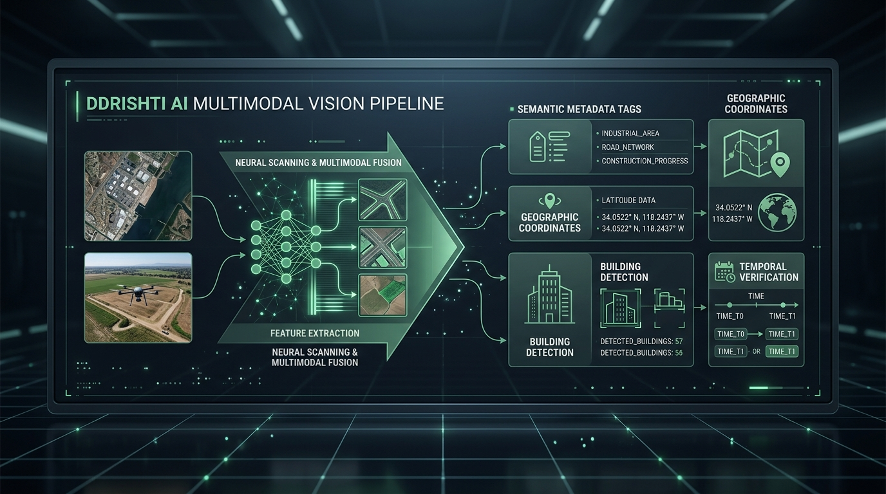
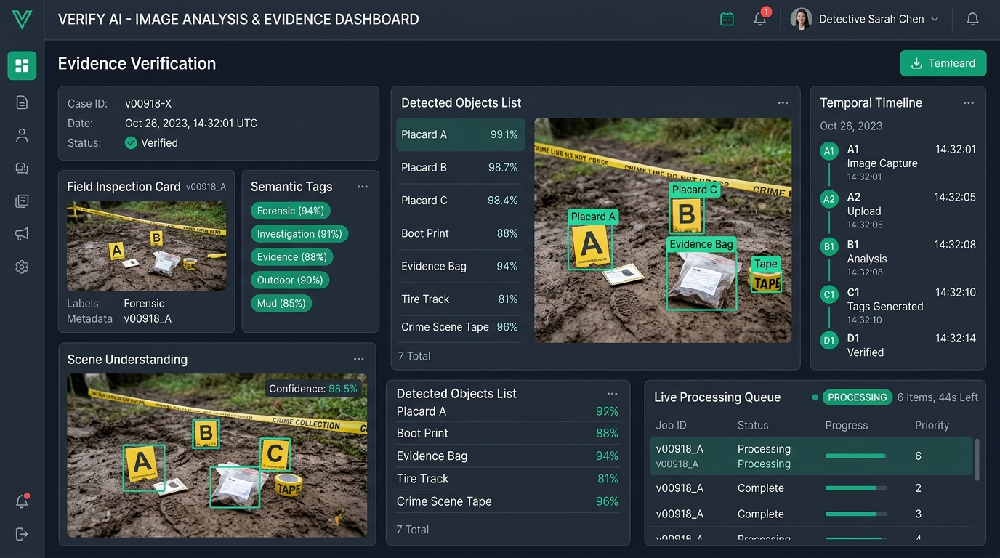

# DivyaDrishti (DDrishti)

**Dynamic Resource for Intelligent Search, Hosting, and Tracking Initiatives**  
*Turning scattered field photos and videos into verified, audit-ready impact intelligence.*

🚀 **Live Deployment**: [https://ddrishti.celi.me/](https://ddrishti.celi.me/)  
🏆 **Hackathon**: Built for **Code Cubicle 6.0** | Geek Room  
🎯 **Themed Track**: **Cloudinary AI Media Intelligence Challenge**  
👨‍💻 **Author**: Built by **Celi | Himadri Shekhar**  
📜 **License**: [MIT](./LICENSE)

---

## 🎯 The Challenge: Cloudinary Media Intelligence

> **"The challenge is to build an AI-powered media intelligence platform using Cloudinary that can understand field media, organize evidence by project, location, and timeline, and help teams turn visual data into reliable insights and impact stories."**

Non-profits, government agencies, disaster responders, and ecological initiatives capture tens of thousands of field photos and video clips across remote project sites. Yet when donors, auditors, or the public ask for proof of work, visual assets remain scattered across phone galleries, chat backups, and unorganized folders.

**DivyaDrishti** closes the gap between ground reality and verified impact:
- **Zero Manual Categorization**: Upload raw field media; the multimodal AI pipeline extracts context, activities, objects, and environmental conditions automatically.
- **Timeline & Location Organization**: Clusters evidence chronologically by daily activity volume and anchors assets to verified GPS sensor coordinates.
- **Auditable Before & After Pairing**: Pairs baseline site conditions with finished interventions for unquestionable proof of progress.
- **Audit-Ready Impact Dossiers**: Directly converts visual evidence into structured reports and impact stories with one-click PDF export.

---

## 🎬 Video Walkthrough & Demo

Experience DivyaDrishti in action — featuring automated EXIF sensor telemetry, reverse geocoding, Drishti Vision AI indexing, dense semantic vector search, timeline daily capture volumes, and the 3-step report export wizard:

▶️ **[Watch Live Video Demonstration (`video demo.mp4`)](./video%20demo.mp4)**

<video src="./video%20demo.mp4" controls width="100%" poster="./docs/images/drishti_evidence_inspector.jpg">
  Your browser does not support the video tag. Click <a href="./video%20demo.mp4">here to watch the video demo</a>.
</video>

---

## 🧠 Multimodal Vision Intelligence Pipeline

DDrishti integrates an on-premise multimodal vision inference engine capable of automated forensic analysis and semantic indexing at scale.



### AI Vision Architecture Highlights
- **Gemma 4 E4B Multimodal Integration**: Operates a quantized local vision-language backbone extracting 8-dimensional evidence signatures:
  - `tag`: Top 5 primary semantic classification tags.
  - `sdsc`: Short single-sentence visual summary.
  - `ddsc`: Comprehensive multi-sentence forensic visual description.
  - `obj`: Identified real-world entities, structures, and objects.
  - `act`: Inferred ongoing activities, operations, and human actions.
  - `scn`: Environmental scene and context classification.
  - `tim`: Lighting and time-of-day condition detection (`morning`, `day`, `evening`, `night`).
  - `cf`: Quantified classification confidence vector.
- **Dual-Queue Worker (`AIIndexingWorker`)**: Background execution with separate `Priority` (user-triggered / newly uploaded) and `Standard` queues governed by a strict concurrency gate.
- **Zero-Loss Temp Compression**: Media sent to inference is dynamically pre-compressed in RAM (82% JPEG, max 1600px edge), accelerating model processing by ~60% while leaving bucket storage media 100% pristine and unaltered.
- **Odd Queue Handling & Startup Hydration**: Auto-detects unindexed assets across project restarts and safely dispatches uneven remaining batches without stalling.

---

## 🚀 Core Modules & Features



### 1. Workspace Drive & Evidence Storage
- **Fluid Widescreen Workstation**: Full-bleed workspace experience utilizing 100% of available screen width, featuring a collapsible sticky sidebar.
- **Batch Upload with Group Naming**: Ingest multiple files simultaneously with batch group tagging and real-time upload progress tracking.
- **Force Index Priority Elevation**: Jump individual or batch assets straight to the head of the AI indexing queue with immediate visual feedback.
- **Live Indexing Status Bar**: Real-time progress bar docked at the bottom of the workspace calculating dynamic rolling ETA (`~Xs / ~Xm remaining`).
- **Interactive Lightbox Inspector**: Dual-tab forensic drawer switching between hardware sensor EXIF telemetry (camera model, ISO, focal length, GPS) and AI Evidence metadata (tags, scene, objects, and summary quotes).

### 2. Explore Studio & Semantic Search
- **Natural-Language Search**: Query natural scenarios (*"people planting trees"*, *"check dam structure"*, *"excavator digging pits"*).
- **Visual Twin Discovery**: Click any image to instantly retrieve visually and semantically twin photos across all projects.
- **Multi-Dimensional Filters**: Filter by time of day (Morning/Day/Evening/Night), quality score tiers (Very High, High, Medium, Degraded), or specific projects.
- **Interactive Geospatial Map**: Leaflet OpenStreetMap view rendering pins for all geotagged evidence photos with popup thumbnails and quick lightbox inspection.

### 3. Chronological Timeline Daily Grouping
- **Daily Capture Volume Clustering**: Automatically groups assets by calendar day with volume badges (*e.g., "15 Pictures Clicked"*).
- **Chronological Sequence**: Sorts days in strict calendar sequence (Newest Day First) to follow field mission progression.
- **Site Coverage Metrics**: Aggregates unique locations and geotagged evidence count per day.

### 4. Export Verified Impact Report
- **Dedicated Sidebar Link**: Direct access to the report generation engine from the main navigation.
- **3-Step Audit Wizard**:
  1. **Select Evidence**: Select all or choose specific photo evidence assets with batch controls and project switching.
  2. **Field Narrative & Pairing**: Document *What are we doing* (mission), *What we did* (operations), *The changes observed* (metrics), select Before & After pairing plates, and provide auditor sign-off notes.
  3. **Printable Dossier**: Generates a verified evidence dossier with one-click **Export PDF Report** (`window.print()`).

### 5. Streamlined Pitch Deck
- Built-in 5-slide interactive pitch deck accessible directly from the top navigation, summarizing the Cloudinary challenge, ground problem, ingestion pipeline, explore search, and roadmap.

---

## 🔮 Upcoming Capabilities & Product Roadmap

We are actively expanding DivyaDrishti with the following planned capabilities:

- 🎥 **Automated Video Analysis & Drone Scene Indexing**: Frame-by-frame temporal scene extraction and motion detection for site drone passes and mobile video recordings.
- 🎨 **Visual Impact Poster & Infographics Generator**: Automated creation of publication-ready impact posters highlighting before/after results and verified environmental metrics.
- 📑 **Automated Multi-Stakeholder PDF Report Generation**: Pre-built report templates tailored for corporate donors, governmental auditors, and community disclosures.
- 🛰️ **Satellite & Drone Orthomosaic Overlay**: Cross-referencing ground-level geotagged photos against aerial satellite passes to verify tree canopy growth and landscape reclamation over time.
- 📱 **Offline-First Field Mobile PWA**: Sensor capture with cryptographic provenance and edge sync when returning to network coverage.

---

## 🛠 Tech Stack

| Layer | Technology | Purpose |
|---|---|---|
| **Frontend Framework** | React 19 + Vite 8 | Reactive user interface & state management |
| **Styling & Design System** | Tailwind CSS v4 + Vanilla CSS Tokens | Widescreen fluid layout, custom design tokens |
| **Animation Engine** | Framer Motion | Fluid transitions, hero path animations |
| **Icons** | Lucide React | Clean, scalable visual iconography |
| **Mapping Engine** | Leaflet + OpenStreetMap | Interactive geospatial coordinate clustering |
| **Backend API** | FastAPI (Python 3.11+) | Async REST endpoints & background worker coordination |
| **Vision Inference Engine** | Google Gemma 4 E4B + llama.cpp | Edge multimodal vision & forensic JSON extraction |
| **Storage & Database** | SQLite + Local Media Buckets | Relational evidence indexing & asset storage |
| **Containerization** | Docker Compose | Multi-container backend & inference deployment |

---

## 💻 Getting Started Locally

### Prerequisites
- Node.js 18+ & npm
- Python 3.10+
- (Optional for AI Indexing) Docker or local llama.cpp vision server running on port 9100

### 1. Clone the Repository
```bash
git clone https://github.com/Celicular/DivyaDrishti.git
cd DivyaDrishti
```

### 2. Backend Setup
```bash
cd backend
python -m venv venv
# Windows:
.\venv\Scripts\activate
# Linux/macOS:
source venv/bin/activate

pip install -r requirements.txt
cp .env.example .env

# Run backend API
python -m uvicorn main:app --reload --port 8000
```

### 3. Frontend Setup
```bash
cd ../project
npm install
npm run dev
```

### 4. Docker Compose Deployment (Backend + Gemma AI)
```bash
cd backend
docker-compose up --build -d
```

### 5. Automated Windows Launch
```bash
.\run.bat
```

---

## 📚 Documentation & Specifications

- [Full Pitch Deck & Product Specification](./DIVYADRISHTI_PITCH_DECK.md)
- [Development Roadmap & Architecture](./UNDER_DEVELOPMENT.md)
